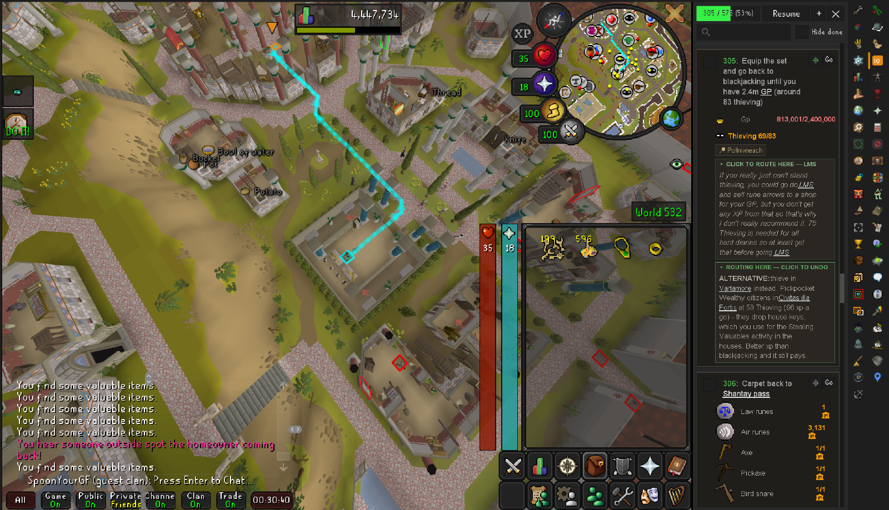
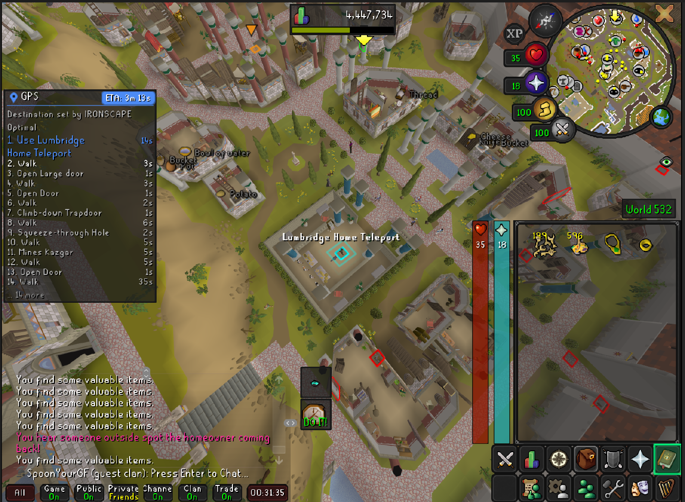
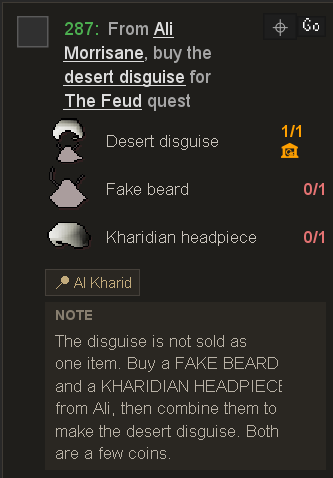
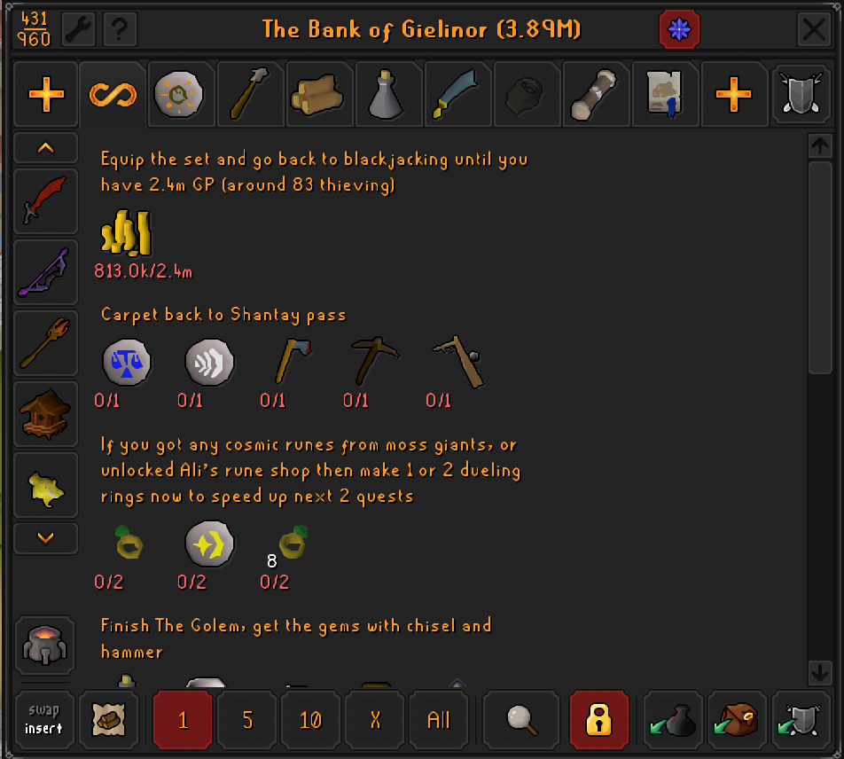

# IRONSCAPE Optimal

The [Ironman Efficiency Guide](https://ironman.guide/) as a step-by-step panel
inside RuneLite. Steps tick themselves off your skills, quests and items,
place names are clickable routes, and the bank shows you what the next few
steps need.

Install it from the RuneLite **Plugin Hub** (wrench icon → Plugin Hub → search
"IRONSCAPE").



Step **305 of 575** with the gp it is waiting on (`813,001/2,400,000`) and the
Thieving level it expects, the route already drawn to where the step happens,
and the next step below it listing what to bring — the 🏦 means it is in the
bank rather than on you. The two green captions are alternatives the guide
offers: click one and the step routes there instead.

---

## What it does

**It follows along, so you don't have to find your place.**
Steps complete on their own from skill levels, quest state, mid-quest
checkpoints, item counts, xp drops, teleports and arrivals. When nothing can
detect a step, it says so plainly and gives you a checkbox — the guide is fully
usable with zero automation.

**It knows where things are.**
Place names, quest names and item names in the step text are links. Click one
and it routes there through [Shortest Path](https://github.com/Skretzo/shortest-path)
or [GPS](https://github.com/PauloAguiar/runelite-gps-plugin) — whichever you have. Steps carry
map pins, so "Go to the Rogues' Den" points at the trapdoor rather than the
middle of Burthorpe.



It works out the first leg for you as well: here it has decided a Lumbridge
home teleport beats walking, and highlighted it.

**It shows you what to bring.**
Every step lists its items with sprites and have/need counts against your
inventory, worn gear and bank. Red means you don't have it, orange with a 🏦
means it's in the bank, green means you're carrying it. When something's
banked, the route offers a bank stop first.



Steps carry notes where the guide has something to say — this one warns that
the disguise is two items you combine, which is the sort of thing you only
find out at the shop.

**The bank knows about the guide.**
A button in the bank (or typing `bruh` in bank search) turns the bank into a
shopping list: each upcoming step becomes its own section with what it needs,
and the items you already own are the real, withdrawable bank widgets.

**It points at the thing.**
NPCs, ground items, ore rocks, market stalls and shopkeepers named by the
current step get outlined, with the item you're after floating over the
vendor's head. Teleport click-paths light up — the Grouping tab, the right
minigame in the list, the spell in your book, or the item in your worn gear.

**It stands aside for Quest Helper.**
On a quest step, Quest Helper owns the click-by-click guidance and our
navigation stands down rather than fighting it for the route. You get a note
telling you which quest to select, and a nudge when the step is finished and
guidance comes back to us.

**Alternatives are one click.**
Where the guide offers another way ("thieve in Varlamore instead"), the note is
clickable and adopts that destination for the step.



---

## Works with

| Plugin | What it adds |
| --- | --- |
| [Shortest Path](https://github.com/Skretzo/shortest-path) **or** [GPS](https://github.com/PauloAguiar/runelite-gps-plugin) | Draws the routes. Install one — **not both**, or you'll get two lines. |
| [Quest Helper](https://github.com/Zoinkwiz/quest-helper) | Click-by-click quest steps. We hand over automatically. |

Neither is required. Without a pathing plugin you lose the routes and keep
everything else.

---

## Guide data

The guide is **bundled with the plugin** — it is not downloaded, and the plugin
makes no network requests at all. Guide updates arrive when the plugin updates.

---

## Feedback and bugs

Please open an [issue](https://github.com/GROBBS-hash/ironscape-optimal/issues).
Screenshots help enormously, and if something misbehaves in game, type
`::ironwrong` at that moment — it writes a small report (which step, where the
route pointed, where you were standing) to
`~/.runelite/ironscape/reports/` that you can paste in.

This is actively developed and I'm happy to keep fixing and adding to it.

---

## Supporting it

It is free and always will be, nothing is gated, and the client never asks you
for anything. If you have got use out of it and want to throw something at it,
there is a Sponsor button at the top of this repo — but please consider
[ironman.guide](https://ironman.guide/) first. The route is their work; I only
wrapped it.

---

## Credits

- **Guide content by [Oziris](https://twitter.com/ozirislol) and the
  [ironman.guide](https://ironman.guide/) community** — the v4 "Enhanced 2026"
  edition, used with their permission. Thank you for maintaining it.
- Navigation integrates with [Shortest Path](https://github.com/Skretzo/shortest-path)
  by Skretzo.
- Mid-quest checkpoint values were cross-checked against
  [Quest Helper](https://github.com/Zoinkwiz/quest-helper)'s open-source quest
  data.

---

## Development

Requirements: JDK 11 or newer (17 works). Gradle is not needed — the wrapper
downloads it.

```
gradlew run
```

launches a RuneLite client with the plugin loaded. Log in on any account and
enable **IRONSCAPE Optimal** in the plugin list.

```
gradlew build
```

compiles and runs the tests.

### Project layout

| Path | What |
| --- | --- |
| `src/main/java/com/ironscape/` | The plugin |
| `src/test/java/.../IronscapePluginTest.java` | Dev launcher (boots a real client) |
| `src/main/resources/.../guide/guide_data_oziris.json` | Bundled guide data (scraped, see tools) |
| `src/main/resources/.../annotations/annotations_oziris.json` | Bundled step annotations |
| `tools/` | Node scripts: guide scraper, seeding and audits |
| `runelite-plugin.properties` | Plugin Hub metadata |

### Tools

- `node tools/scrape-oziris.mjs` — refreshes the bundled guide from
  ironman.guide (their pages embed author-structured step data: text,
  locations, quests, skill goals, item lists, notes). Hand-authored annotation
  keys (quest checkpoints, captured targets) survive the refresh.
- `node tools/check-all.mjs --tests` — runs every audit and the test suite.
- `node tools/preflight.mjs` — reads your saved position and reports what the
  next steps can and cannot do.
- `node tools/seed-places.mjs [--quests|--locations|--links|--pois]` — seeds
  `places.json` (the clickable place-name links) from the OSRS Wiki.

### Annotating steps

Annotations make the plugin smarter but are always optional.

- **Locations:** click the ⌖ button on any step while standing at the right
  spot in game. Saved to `~/.runelite/ironscape/annotations.json`.
- **Mid-quest checkpoints:** requirements like `{"varbit": 5619, "value": 5}`
  tick a step when a quest reaches a certain point ("do the quest until the
  orb"). See `PrintSubIdProbe` for finding step ids.

## License

BSD 2-Clause (see [LICENSE](LICENSE)). Guide content by Oziris & the
ironman.guide community, bundled with permission.
