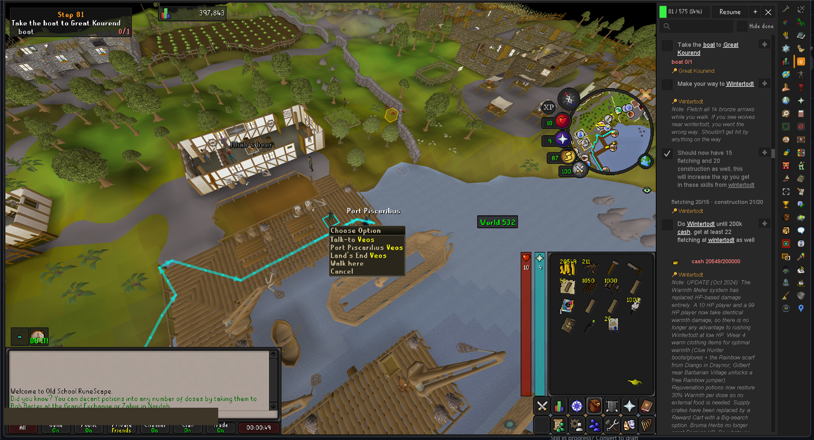
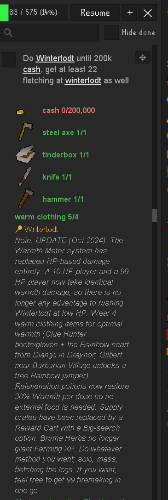
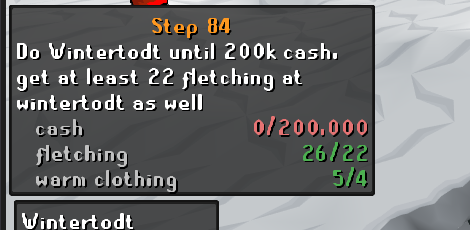

# IRONSCAPE Optimal — user guide

Everything the plugin does, one feature at a time. If you only read one
line: **open the side panel, press Resume, and do what the top step
says** — the plugin ticks most steps off by itself and routes you to
the next one.

---

## Getting started

1. Install **IRONSCAPE Optimal** from the Plugin Hub (and ideally
   [Shortest Path](https://github.com/Skretzo/shortest-path) — the
   plugin uses it for on-map navigation, and works fine without it).
2. Click the plugin's sidebar icon. The panel opens **on your current
   step** — it finds where you are from your skills, quests and items,
   so a mid-account start is fine.
3. Play. Steps tick themselves off as you complete them; anything the
   plugin can't detect keeps a normal checkbox.

## The step panel

Each step is a tick-list. The plugin watches your gameplay and ticks
steps for you when it can tell they're done — skill levels, quest
completions, item counts, teleports, arrivals, even mid-quest
checkpoints ("do the quest up to the orb").

**Everything underlined is clickable:**

- **Place and NPC names** ("wintertodt", "Diango") — click to route
  there via Shortest Path.
- **Item names** — click to open that item's OSRS Wiki page (how to
  make a hangover cure, where to find dwellberries).
- **Quest names** — click to mark the quest start point in the world;
  if you have Quest Helper installed, the quest is opened in it too.
- **"world 444"** — click to hop to that world.

**Under each step, live badges:**

- `cash 20,529/200,000` — item goals, colored red (not enough), orange
  (enough, but it's in the bank) or green (ready). Gold counts your
  bank; items you're meant to carry count what's on you.
- `fletching 25/15 · construction 21/20` — skill targets, green once
  reached (and the step ticks itself).
- `warm clothing 5/4` — gear checks: how many qualifying items you're
  carrying or wearing right now (the Wintertodt warm-clothing list
  comes straight from the wiki — all 196 items count, and a Bruma
  torch counts as your tinderbox). Informational only.
- 📍 **location chips** and *italic notes* carry the guide's own
  context for the step.

**Toolbar:** the progress bar tracks the whole guide; **Resume** jumps
to your current step and redraws the route; the search box finds any
step; **Hide done** collapses what's finished.

**The ⌖ button** on every step saves *your current position* as that
step's target — future navigation and markers use your captured spot.
Annotate as you play; it's how the bundled data was built.

## The on-screen step box

The overlay shows your current step and its live requirements without
opening the panel — one line per goal, same colors as the panel.
Satisfied items drop off the list, so it reads as "what's still
missing". Alt-drag to move it; toggle it in the plugin settings.

## In-world markers

- **NPC outlines** — the NPC your step is about (quest giver,
  shopkeeper, Phials to un-note your planks) gets a green outline, with
  **the item you're there to buy floating over their head**.
- **Quest start marker** — a blue quest icon floats at the quest's
  start point until you begin it (then Quest Helper takes over).
- **Target tiles** — captured ⌖ spots (dig spots, item spawns) are
  highlighted in the world; ground items your step wants show a marker
  on their tile.
- **Teleport hints** — "Minigame teleport to Clan Wars" or "Home tele
  to Lumbridge" highlights the actual click path, Quest Helper-style:
  the side tab, then the spell or dropdown entry, one click at a time.

## Navigation

With Shortest Path installed, the plugin drives it for you:

- After every completed step, the route re-points at the next step's
  target automatically.
- When a step's items are sitting in your bank, it routes you to the
  **nearest bank** first.
- Land a teleport and the route recalculates from where you arrived.
- While a quest is **in progress**, the plugin's navigation stands down
  completely — Quest Helper's guidance is the only thing on screen —
  and resumes the moment the quest completes.

## The bank filter

Click the **IRONSCAPE button inside the bank** (or type `bruh` in the
bank search). The bank redraws as your shopping list: every upcoming
step becomes its own section — the step's text as a header, all of its
items below with green/red `have/need` counts. Items you own are the
**real bank widgets**, so you withdraw straight from the filtered view
(even items from other tabs); items you still need to buy or gather
show as ghosts. Click any real tab to go back to your normal bank.

## When detection is wrong

It happens — the guide is prose, and detection is honest about being
heuristic:

- **A step ticked too early / didn't tick:** just click the checkbox.
  Manual ticks are always respected and move your position in the
  guide; unticking re-opens a step.
- **You did things out of order:** the plugin anchors on *your
  position*, not the furthest tick — steps you deliberately skipped
  stay skipped, and pre-completed quests ahead of you don't drag you
  forward.
- **Re-banking items re-opens their step** on purpose: the tick meant
  "in hand", and upcoming steps still need them. (Money is exempt —
  banked gold still counts, and spending it later never re-opens a
  finished money goal.)

## Settings

Everything visual can be toggled in the plugin's settings: the step
overlay, teleport hints, quest start marker, target/ground markers,
capture buttons, auto-completion, and auto-navigation.

---

*Guide content by [Oziris](https://twitter.com/ozirislol) and the
[ironman.guide](https://ironman.guide/) community, bundled with
permission. Found a step that detects wrongly? Open an issue with a
screenshot — most fixes ship same-day.*
